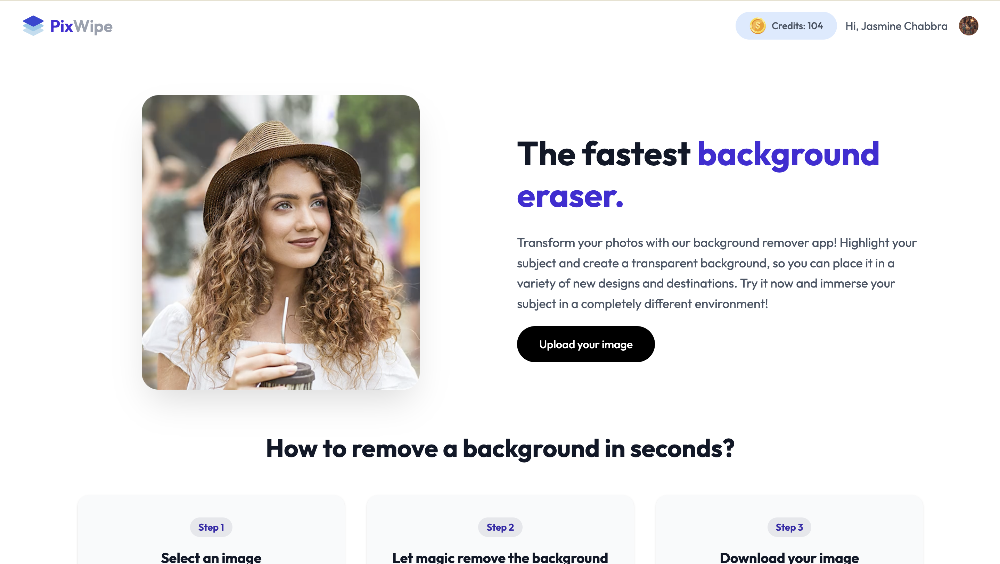
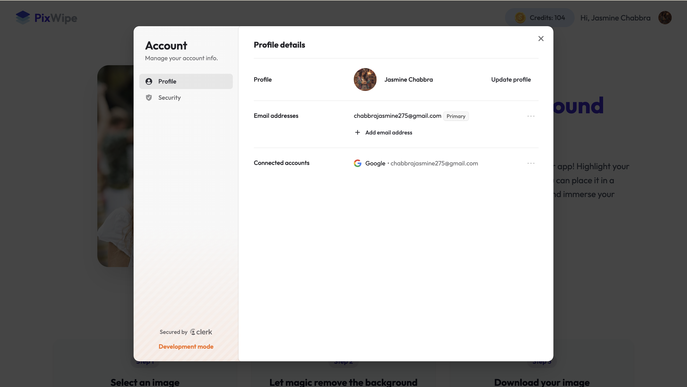

# PixWipe

> AI-powered background removal SaaS application built with React and Spring Boot.

PixWipe is a full-stack SaaS application that allows users to remove image backgrounds using an AI-powered image processing API. The application includes secure authentication, credit-based usage, persistent user data, and Razorpay-powered credit purchases.

## 🚀 Features

- 🖼️ AI-powered image background removal
- 🔐 Secure user authentication with Clerk
- 👤 Automatic user synchronization with backend
- 💳 Credit-based image processing system
- 💰 Razorpay payment integration
- 🗄️ MySQL database for persistent user and order data
- 🔒 JWT-based backend authentication
- ☁️ REST API based frontend-backend communication
- 📱 Responsive React UI
- ⚡ Fast Vite development environment
- 🔄 Automatic credit deduction after successful processing
- 🧾 Order creation and payment verification

---

## 🏗️ Architecture

```text
                    ┌─────────────────────┐
                    │      React UI       │
                    │      Vite           │
                    └──────────┬──────────┘
                               │
                               │ REST API
                               ▼
                    ┌─────────────────────┐
                    │   Spring Boot API   │
                    │                     │
                    │ Controllers         │
                    │ Services            │
                    │ Spring Security     │
                    │ JPA / Hibernate     │
                    └──────┬───────┬──────┘
                           │       │
              ┌────────────┘       └─────────────┐
              ▼                                  ▼
      ┌───────────────┐                  ┌───────────────┐
      │     MySQL     │                  │  External APIs│
      │               │                  │               │
      │ Users         │                  │ Clerk         │
      │ Orders        │                  │ Clipdrop      │
      │ Credits       │                  │ Razorpay      │
      └───────────────┘                  └───────────────┘
````

---

## 🛠️ Tech Stack

### Frontend

* React 18
* Vite
* Tailwind CSS
* React Router
* Axios
* Clerk React SDK
* Lucide Icons

### Backend

* Java 17
* Spring Boot 3.4.5
* Spring Web
* Spring Security
* Spring Data JPA
* Hibernate
* Spring Cloud OpenFeign
* Lombok
* Maven

### Database

* MySQL

### Integrations

* Clerk — Authentication & user management
* Clipdrop — AI image background removal
* Razorpay — Payment processing

---

## 🔄 Application Flow

### 1. User Authentication

Users sign up or sign in through Clerk.

After authentication, the frontend synchronizes the authenticated user with the Spring Boot backend.

```text
User
  ↓
Clerk Authentication
  ↓
JWT Token
  ↓
Spring Security
  ↓
Backend User Sync
  ↓
MySQL
```

### 2. Background Removal

```text
Upload Image
     ↓
Frontend
     ↓
Spring Boot API
     ↓
Check Authentication
     ↓
Check Credit Balance
     ↓
Clipdrop API
     ↓
Background Removed
     ↓
Credit Deducted
     ↓
Processed Image Returned
```

Each successful background-removal operation consumes one credit.

### 3. Credit Purchase

```text
Select Plan
    ↓
Spring Boot
    ↓
Create Razorpay Order
    ↓
Razorpay Checkout
    ↓
Payment
    ↓
Payment Verification
    ↓
Credits Updated
```

---

## 🔌 API Endpoints

### User APIs

| Method | Endpoint             | Description                         |
| ------ | -------------------- | ----------------------------------- |
| POST   | `/api/users`         | Create or update authenticated user |
| GET    | `/api/users/credits` | Get current user's credit balance   |

### Image APIs

| Method | Endpoint                        | Description             |
| ------ | ------------------------------- | ----------------------- |
| POST   | `/api/images/remove-background` | Remove image background |

### Order APIs

| Method | Endpoint                      | Description           |
| ------ | ----------------------------- | --------------------- |
| POST   | `/api/orders?planId={planId}` | Create Razorpay order |
| POST   | `/api/orders/verify`          | Verify payment        |

### Webhook

| Method | Endpoint              | Description              |
| ------ | --------------------- | ------------------------ |
| POST   | `/api/webhooks/clerk` | Handle Clerk user events |

---

## 📁 Project Structure

```text
PixWipe/
│
├── Backend/
│   ├── src/
│   │   ├── main/
│   │   │   └── java/
│   │   │       └── com/Jasmine/removebg/
│   │   │           ├── client/
│   │   │           ├── config/
│   │   │           ├── controller/
│   │   │           ├── dto/
│   │   │           ├── entity/
│   │   │           ├── repository/
│   │   │           ├── response/
│   │   │           ├── security/
│   │   │           └── service/
│   │   │
│   │   └── test/
│   │
│   ├── pom.xml
│   └── mvnw
│
├── Frontend/
│   ├── src/
│   │   ├── assets/
│   │   ├── components/
│   │   ├── context/
│   │   ├── pages/
│   │   └── service/
│   ├── package.json
│   └── vite.config.js
│
├── Project-Images/
│   ├── FrontView(2).jpg
│   ├── FrontView(3).jpg
│   ├── FrontView(4).jpg
│   ├── LiveDemo.jpg
│   ├── MainView(1).jpg
│   ├── Confirmed Payment through RazorPay.jpg
│   └── My-Sql Storing Database.png
│
├── .gitignore
└── README.md
```

---

## 📸 Screenshots

### Home Page



### Application UI


### Profile & Security



### Authentication


### Razorpay Payment


### MySQL Database


---

## ⚙️ Local Setup

### Prerequisites

Make sure you have:

* Java 17+
* Maven
* Node.js
* npm
* MySQL
* Clerk account
* Clipdrop API key
* Razorpay account

---

## 1️⃣ Clone the Repository

```bash
git clone https://github.com/JasmineChabbra/PixWipe.git
cd PixWipe
```

---

## 2️⃣ Setup MySQL

Create the database:

```sql
CREATE DATABASE removebgdb;
```

Update the backend database configuration in your local environment.

> Do not commit credentials, API keys, or secrets to GitHub.

---

## 3️⃣ Backend Configuration

Create:

```text
Backend/src/main/resources/application.properties
```

Configure your local values for:

```properties
spring.datasource.url=jdbc:mysql://localhost:3306/removebgdb
spring.datasource.username=YOUR_MYSQL_USERNAME
spring.datasource.password=YOUR_MYSQL_PASSWORD

spring.jpa.hibernate.ddl-auto=update

clerk.issuer=YOUR_CLERK_ISSUER
clerk.jwks-url=YOUR_CLERK_JWKS_URL
clerk.webhook.secret=YOUR_CLERK_WEBHOOK_SECRET

clipdrop.apikey=YOUR_CLIPDROP_API_KEY

razorpay.key.id=YOUR_RAZORPAY_KEY_ID
razorpay.key.secret=YOUR_RAZORPAY_KEY_SECRET
```

Keep this file local and never commit it.

---

## 4️⃣ Start Backend

```bash
cd Backend
./mvnw spring-boot:run
```

Backend runs on:

```text
http://localhost:8080
```

---

## 5️⃣ Setup Frontend

Open another terminal:

```bash
cd Frontend
npm install
```

Create:

```text
Frontend/.env
```

Add:

```env
VITE_CLERK_PUBLISHABLE_KEY=YOUR_CLERK_PUBLISHABLE_KEY
VITE_BACKEND_URL=http://localhost:8080/api
VITE_RAZORPAY_KEY_ID=YOUR_RAZORPAY_KEY_ID
```

Start the frontend:

```bash
npm run dev
```

Frontend runs on:

```text
http://localhost:5173
```

---

## 🔐 Security

Secrets are intentionally excluded from version control.

The project uses:

* Clerk authentication
* JWT validation
* Spring Security
* Environment/local configuration for API credentials
* `.gitignore` protection for sensitive configuration

Never commit:

```text
.env
application.properties
API keys
database passwords
JWT secrets
payment secrets
webhook secrets
```

---

## 💳 Credit System

New users receive an initial credit balance.

When a user processes an image:

```text
Available Credits > 0
        ↓
Process Image
        ↓
Successful Response
        ↓
Credits - 1
```

If the user's balance reaches zero, image processing is blocked until additional credits are purchased.

---

## 🧪 Testing

The backend can be started locally using Maven:

```bash
cd Backend
./mvnw test
```

Frontend production build:

```bash
cd Frontend
npm run build
```

---

## 🎯 Key Engineering Highlights

* Full-stack React + Spring Boot architecture
* RESTful API design
* Authentication using Clerk
* JWT-based authorization
* MySQL persistence with Spring Data JPA
* External API integration using OpenFeign
* AI-powered image processing
* Payment gateway integration with Razorpay
* Credit-based business logic
* DTO and service-layer based backend architecture
* CORS configuration for frontend-backend communication
* Secure handling of application secrets

---

## 📌 Future Improvements

* Cloud deployment
* S3-based image storage
* Image processing history
* Subscription-based plans
* Rate limiting
* Centralized exception handling
* Automated CI/CD pipeline
* Comprehensive unit and integration test coverage
* Production monitoring and logging

---

## 👨‍💻 Author

**JasmineChabbra**

GitHub:
[https://github.com/JasmineChabbra](https://github.com/JasmineChabbra)

---

## ⭐ Project

If you find PixWipe useful, consider giving the repository a star.

Built with ❤️ using React, Spring Boot and AI-powered image processing.

